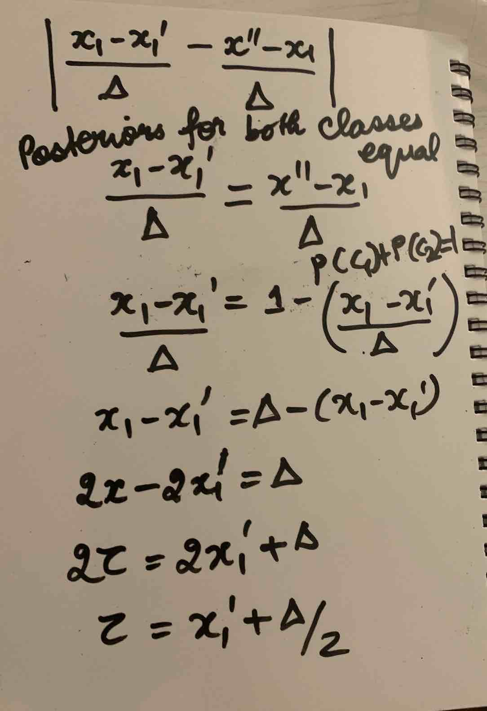

# Chapter 4: Classification Forests

Source: [Decision Forests for Computer Vision and Medical Image Analysis](https://link.springer.com/book/10.1007/978-1-4471-4929-3) Chapter 4

Goal: Associate input **v** with a discrete class _c_ &epsilon; {_ck_}

## **Properties of Classification Forests**
* Extendable to more than 2 classes 
* Provide probabilistic output
* Generalize well to previously unseen data 
* Efficient (only a small set of tasks applied to each data point)
* Can be parallelized 
* Yield good generalization, even in problems with high dimensionality 
* _Under certain conditions_ classification forests show margin maximization properties 
* _By controlling choice of specific parameters_ the quality of the posterior and the associated confidence can be controlled 

 

**In principle, Classification Trees can work unmodified with any number of classes**  
Other classification algorithms such as SVMs, boosting, etc cannot work with more than 2 classes without a forced extension  

 

## **Specializing the Decision Forest Model for Classification**

 

> Classification Task:   Given a labelled set of training data, learn a general mapping which associates previously unseen test data with their corresponding classes 

  

> Inductive Task:   Typically has the need for a general rule that can be applied to "not-yet-available" test data 

  

Each training point is denoted as a pair (**v**, _c_)  
More generally, we wish to find the whole distribution p(_c_|**v**)  
And input **v** is represented as multi-dimensional vector of feature responses **v** = (x1, x2, x3... xd) &epsilon; ℝ

 

* Training Object Function: 
    * Train parameters of the weak learner via: 
    
     

    

      

    * Objective Function _I_ takes the form of information gain: 

     

    

      

    * Entropy for a generic set S of training points: 

     

    

      

    * _p(c)_ is calculated as the normalized empirical histogram of labels correctly corresponding to the training points in S 

    * Maximizing information gain -> Produces trees where the entropy of the class distributions associated with the nodes decreases i.e. the prediction confidence increases when going from the root towards the leaves 

     Thus, certainty of prediction keeps increasing 

* Class Re-balancing 
    * PROBLEM: Unbalanced distribution of classes in the training set S0
    * FIX v1: Resample training data to get roughly uniform training distributions
    * FIX v2: Use the known prior class distribution : Weight contribution of each class by inverse frequency while computing info gain

* Randomness
    * Injected via randomize dnode optimization
    * &rho; = |&Tau;j| controls the amount of randomness
    * Generate each random subset &Tau;j before starting training of the corresponding node 

* Leaf & Ensemble Prediction Models 
    * Tree leaf yields the posterior _pt_(_c_|**v**)
    * Forest output is defined as: 
     
    
    
 
        
## **Effect of Model Parameters**
 

* Objective function (direct relation)
* Prediction model (direct relation )
* Effect of Forest Size: 
    * Increasing forest size produces smoother posteriors
    * Higher confidence near training points and lower further away 
    * Few trees -> Rigid boundaries, imperfect generalization
* Multiple Classes & Training Noise: 
    * Training Noise: Larger overall uncertainty in the testing posterior 
* Effect of Tree Depth: 
    * Increase of tree depth increases the overall prediction confidence 
    * In large gaps, the optimal separating surface tends to be placed in the middle of the gap (yay!)
    * Large value of D (Tree Depth) causes overfitting 
    * Shallow trees produced washed-out, low-confidence posteriors
    * Multiple trees alleviates overfitting problems of individual trees, but does not eliminate it completely 
    * Important to select the most appropriate value of D 
* Effect of the Weak Learner 
    * Weak learner with best behavior depends on the application
    * AIM: To show that decision forests are flexible & can produce different confidence behaviours 
    * Choice of weak learner is based on: 
        * Accuracy
        * Efficiency
        * Specific application
* Effect of Randomness
    * Large randomness: blocky artifacts in axis-aligned weak learners, more rounded decision boundaries
    * Much lower overall confidence 
    * Complex weak learners work well for large randomness, but take time to stabilize

 

## **Maximum Margin Classification with Forests**
 

The ability to separate data belonging to different classes via a margin-maximizing surface allows good generalization even with relatively little training data.  

When we train the root of the first tree, if we have enough candidate features i.e. |&Tau;0| is large, the decision boundary lies in the gap. Any separating line in the gap can act as a decision boundary, and will be associated with the exact same maximum information gain.  

AIM: To pick the line so that the posteriors of both the adjacent classes are equal at the line i.e. pick the solution right in the middle of the gap   

Consider the example of linearly separable training data: 
* Weak learners: Vertical lines only i.e. _h_(**v**, **&theta;j**) = [ &phi;(**v**) > &tau;] with &phi;(**v**) = _x1_
* Define gap &Delta; = _x"1 - x'1_ (_x"1_ = 1st feature of support vectors & _x'1_ 2nd feature of support vectors)
* If we keep y-coordinate fixed, the posteriors are _p_(_c_|x1) and _p_(_c_|x2) for c1 and c2 respectively
* Optimal separating line is at &tau;* where:
    &tau;* = minimize by varying &tau; |p(c=c1|x1 = &tau;) - p(c = c2|x1 = &tau;)|
* ASSUME: When training a node, its available test parameters (here, just &tau;) are sampled from a uniform distribution 
* THEN, Forest posteriors behave linearly within the gap region and pick the centre as the decision boundary 
* This only occurs as number of trees tends to infinity 

  

### **Effect of Randomness on Optimal Separation**

 

More randomness -> Fewer trees -> Individual trees may not split data perfectly -> Sub optimal information gain -> Lower confidence in posterior -> Decision boundary is not at the centre & is less sharply defined -> Effect of Mass of Training Data > Effect of Individual Points 

 

### **Influence of the Weak Learner Model**

 
Linear weak learners -> Globally non linear classification (due to hierarchy and averaging)
    

