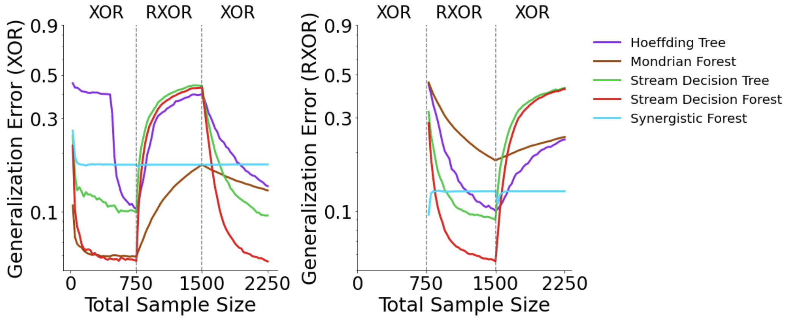

# Current State of Streaming in Proglearn/SDTF 
As of 1/26/2022
### Open Issues
 - Proglearn 
    - [#501 Add update_task to proglearn for data streaming](https://github.com/neurodata/ProgLearn/issues/501)
        - status: not working, constant error issue (see below image)
        - my highest priority (experiments are dependent on update_task working correctly)
        - working through understanding Kevin's code currently so I can debug
    - [#502 Add streaming XOR Experiments](https://github.com/neurodata/ProgLearn/issues/502)
        - the experiments described in this issue are part of SDTF as of now (see #36)
        - question: should we change this issue to: *update proglearn gaussian experiments to use update_task/partial fitting?*

 - SDTF
    - [#36 Add SynF to Gaussian Simulation Experiments](https://github.com/neurodata/SDTF/issues/36)
        - status: Experiments are ready to run when `update_task` is debugged (need to resolve constant error issue shown below)
        

### `update_task`
- current issue
```python
#Simple script to test update_task
import numpy as np 
from proglearn.forest import LifelongClassificationForest
from proglearn.sims import generate_gaussian_parity

synf = LifelongClassificationForest()
x,y = generate_gaussian_parity(10)
test_x, test_y = generate_gaussian_parity(10)
synf.add_task(x,y,task_id=0)

for i in range(200):
  x_,y_ = generate_gaussian_parity(10)
  synf.update_task(x_,y_, inputclasses = [0,1], task_id=0)
  y_hat = synf.predict(test_x,task_id=0)
  print("PREDICTION {}".format(y_hat))
  print("LABELS  {}".format(test_y))
  print("ERROR   {}".format(1-np.mean(y_hat == test_y)))
```
gives the following output: 
```
unique y values in update_task: [0 1]
PREDICTION [0 1 0 0 1 0 1 1 1 1]
LABELS     [1 1 0 0 0 0 0 1 1 0]
ERROR      0.4
unique y values in update_task: [0 1]
PREDICTION [1 1 0 0 1 0 1 1 1 1]
LABELS     [1 1 0 0 0 0 0 1 1 0]
ERROR      0.30000000000000004
unique y values in update_task: [0 1]
PREDICTION [1 1 0 0 1 0 1 1 1 1]
LABELS     [1 1 0 0 0 0 0 1 1 0]
ERROR      0.30000000000000004
unique y values in update_task: [0 1]
PREDICTION [1 1 0 0 1 0 1 1 1 1]
LABELS     [1 1 0 0 0 0 0 1 1 0]
ERROR      0.30000000000000004
.
.
.
unique y values in update_task: [0 1]
PREDICTION [1 1 0 0 1 0 1 1 1 1]
LABELS     [1 1 0 0 0 0 0 1 1 0]
ERROR      0.30000000000000004
unique y values in update_task: [0 1]
PREDICTION [1 1 0 0 1 0 1 1 1 1]
LABELS     [1 1 0 0 0 0 0 1 1 0]
ERROR      0.30000000000000004

```
after the first call to `update_task` error does not decrease

## Pseudocode for `update_task`
```
forest.update_task
    calls progressive_learner.update_task
        check if task id is given (error if not)
        update current X data for task with additional X data 
        update current y data for task with additional y data 
        split into transformer/voter and decider data 
        call update_transformer 
            for all transformers referring to task
                partial fit transformer
        set voter 
        set decider 

```

